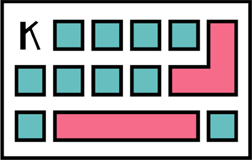

<p align="center"></p>

# shortcuts

> help you find shortcuts such as excel, photoshop and so on.

## Build Setup

``` bash
# install dependencies
npm install

# serve with hot reload at localhost:8080
npm run dev

# build for production with minification
npm run build

# build for production and view the bundle analyzer report
npm run build --report
```

## TODO
1. <del>搜索列表关键字高亮</del>
1. <del>模糊搜索，同时支持快捷键和中文查询</del>
2. <del>增加卡片页</del>
3. <del>用户登录页</del>
4. <del>收藏页</del>
5. <del>消息页</del>
6. 规范格式：请求参数名、返回格式和错误码，提示等等（doing）
7. 增加权限（doing）
8. 支持多参搜索（High）
9. <del>卡片内容重新设计</del>
10. navigateTo 等跳转失败封装
11. 个人中心页、收藏页 UI 设计
12. 测试截图的长宽比


## issues
1. 首页跳转到列表页，返回后搜索框应该在中间，且不应该有从上下来的动画
2. placeholder active 状态下 placeholder-class 属性不起作用
